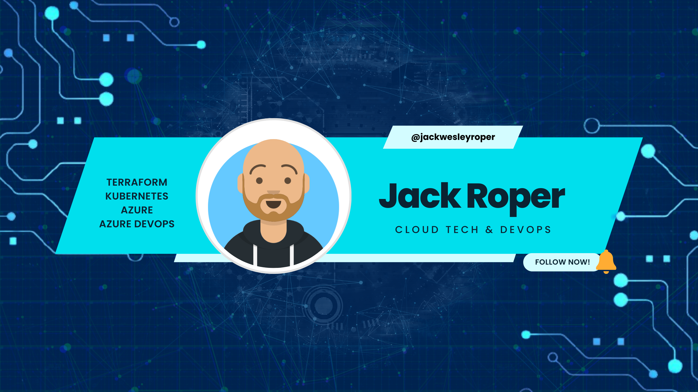

# jackwesleyroper-blog-public



## Table of Contents
- [jackwesleyroper-blog-public](#jackwesleyroper-blog-public)
  - [Table of Contents](#table-of-contents)
  - [Introduction](#introduction)
  - [Features](#features)
  - [Installation](#installation)
  - [Usage](#usage)
  - [Contributing](#contributing)
  - [License](#license)
  - [Contact](#contact)

## Introduction
Welcome to **Jackwesleyroper-blog-public**! This project aims to A collection of sample files as featured on my blog https://jackwesleyroper.medium.com. Please hit the follow button or give the article a clap on Medium, it will really help me out! 

## Features
- Terraform examples
- Kubernetes examples
- Essential repo setup files
- Github templates examples

## Installation
Follow these steps to install the project on your local machine:

1. **Clone the repository**:
   ```sh
   git clone https://github.com/jackwesleyroper/jackwesleyroper-blog-public.git
   cd jackwesleyroper-blog-public
   ```
## Usage
Feel free to experiemnt with the provided files and use the blog posts on https://jackwesleyroper.medium.com to follow along with examples.

## Contributing
If you would like to contribute, please fork the repository and use a feature branch. Pull requests are warmly welcome.

## License
This project is licensed under the MIT License - see the LICENSE file for details.

## Contact
If you have any questions or feedback, feel free to reach out to me on GitHub @jackwesleyroper.